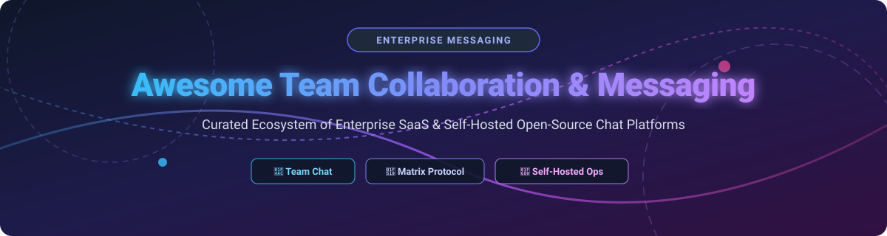

  

# 💬 Awesome Team Collaboration & Messaging Platforms (2026) 🚀

  
  
  
  

A curated list of **commercial team collaboration platforms**, **enterprise messaging SaaS**, and **self-hosted open-source team chat software**. This guide covers channel-based chat 🗨️, threaded discussions 🧵, federated protocols 🌐, WebRTC video conferencing 📹, and end-to-end encrypted communication solutions 🔐 for remote teams and IT administrators.

---

## 📑 Table of Contents
- [📊 Market Overview & Industry Insights](#-market-overview--industry-insights)
- [🏢 SaaS & Commercial Hosted Platforms](#-saas--commercial-hosted-platforms)
- [💻 Open-Source GitHub Projects](#-open-source-github-projects)
- [⚖️ Key Architectural Trade-Offs](#%EF%B8%8F-key-architectural-trade-offs)
- [💖 Support & Sponsorship](#-support--sponsorship)
- [🌟 Star History](#-star-history)
- [🤝 How to Contribute](#-how-to-contribute)
- [⚠️ Disclaimer](#%EF%B8%8F-disclaimer)

---

## 📊 Market Overview & Industry Insights

The global team collaboration software market is estimated at **$31.5 Billion (2026)** and is **highly concentrated** (winner-take-most dynamics), dominated by enterprise ecosystem leaders Microsoft (Teams) and Salesforce (Slack), alongside specialized heavyweights like Discord in community/gaming and Google Chat in cloud suites. 📈

---

## 🏢 SaaS & Commercial Hosted Platforms

The table below outlines leading commercial team messaging platforms sorted by company size (valuation / annual revenue, descending), including precise starting paid tier pricing and exact free tier limits. 💳

| Platform | Company Size (Valuation / Revenue) | Starting Paid Pricing | Free Tier / Trial Limit | Key Features & Best Use Case |
| :--- | :--- | :--- | :--- | :--- |
| **[Microsoft Teams](https://www.microsoft.com/microsoft-teams/)** | **$3.1 Trillion** (Market Cap) | $4.00 / user / month (Essentials) | Free plan with 60-min meeting limit, 100 participants, and 5 GB cloud storage per user. | Enterprise hub with deep Office 365 integration, video meetings, and calling. Best for Microsoft ecosystem enterprises. 🏢 |
| **[Google Chat](https://workspace.google.com/products/chat/)** | **$2.1 Trillion** (Market Cap) | $6.00 / user / month (Business Starter) | 14-day free trial of Google Workspace (requires Workspace subscription after trial). | Spaces, threaded discussions, and native Google Workspace integration. Best for Google Workspace users. 🌐 |
| **[Salesforce Slack](https://slack.com/)** | **$260 Billion** (Market Cap) | $7.25 / user / month (Pro, billed annually) | Free plan with 90-day message history, 10 integrations, and 1-on-1 Huddles. | Pioneer of channel messaging, Slack Connect, Huddles, and 2,600+ integrations. Best for modern tech teams. ⚡ |
| **[Cisco Webex](https://www.webex.com/)** | **$220 Billion** (Market Cap) | $14.50 / user / month (Webex Meet / Suite) | Free plan with 40-min meeting limit, up to 100 attendees, and basic team messaging. | Enterprise calling, meeting suites, and messaging with HIPAA/SOC2 compliance. Best for corporate & regulated enterprises. 🏛️ |
| **[Discord](https://discord.com/)** | **$15 Billion** (Valuation) | $9.99 / month (Nitro) or $2.99 / month (Nitro Basic) | Free plan with unlimited text chat, screen share up to 720p/30fps, 25 MB file uploads, and community servers. | Real-time low-latency voice, video, and text channels. Best for gaming, Web3, and online communities. 🎮 |
| **[Rocket.Chat Cloud](https://rocket.chat/)** | **$150 Million** (Valuation) | $4.00 / user / month (Starter, min 25 seats) | 30-day free trial of Enterprise Cloud; self-hosted community edition remains free. | Omnichannel customer communication, matrix federation, and compliance auditing. Best for customer support & enterprise chat. 🚀 |
| **[Flock](https://flock.com/)** | **$100 Million** (Valuation) | $4.50 / user / month (Pro, billed annually) | Free plan for up to 20 team members, 10,000 searchable messages, and 5 GB total storage. | Lightweight team chat with integrated shared to-dos, polls, and video calling. Best for SMBs. 🐣 |
| **[Mattermost Cloud](https://mattermost.com/)** | **$80 Million** (Valuation) | $10.00 / user / month (Professional) | Free plan for up to 50 users with channel messaging, file sharing, and playbook workflows. | Secure DevOps collaboration, custom playbooks, and developer tool integrations. Best for technical & engineering teams. 🛠️ |
| **[Chanty](https://www.chanty.com/)** | **$10 Million** (Valuation) | $3.00 / user / month (Business, billed annually) | Free plan for up to 10 team members with unlimited message history and built-in Kanban task management. | Simple AI-powered team chat with integrated task management. Best for small businesses & budget-conscious teams. 🎯 |

---

## 💻 Open-Source GitHub Projects

Self-hosted open-source team chat applications sorted by GitHub Stars_Counts (descending). Each repository link includes a live Stars_Badge linking directly to its GitHub stargazers page. 🔓

| Repository & Project | GitHub Stars_Badge | License | Description & Key Strengths |
| :--- | :--- | :--- | :--- |
| **[Rocket.Chat](https://github.com/RocketChat/Rocket.Chat)** |  | MIT | Enterprise open-source chat server featuring channel messaging, video conferencing, live chat widgets, and omnichannel integrations. 🚀 |
| **[Mattermost](https://github.com/mattermost/mattermost-server)** |  | MIT / AGPLv3 | Enterprise-grade self-hosted Slack alternative designed for technical teams requiring strict data sovereignty and compliance. 🛡️ |
| **[Jitsi Meet](https://github.com/jitsi/jitsi-meet)** |  | Apache-2.0 | WebRTC video conferencing platform providing encrypted, multi-party video meetings and chat integrations. 🎥 |
| **[Zulip](https://github.com/zulip/zulip)** |  | Apache-2.0 | Real-time team chat with unique topic-based threading, optimized for asynchronous communication across distributed teams. 🧵 |
| **[Element (Matrix Web)](https://github.com/element-hq/element-web)** |  | Apache-2.0 | Secure, end-to-end encrypted web client built on the decentralized Matrix protocol for federated cross-organization messaging. 🔐 |
| **[Tinode](https://github.com/tinode/chat)** |  | GPL-3.0 | Instant messaging server written in Go with gRPC, WebSocket, and REST API support, built for high performance. ⚡ |
| **[Matterbridge](https://github.com/42wim/matterbridge)** |  | Apache-2.0 | Multi-protocol bridge connecting Mattermost, IRC, XMPP, Slack, Discord, Telegram, Matrix, and WhatsApp channels. 🌉 |
| **[Synapse](https://github.com/element-hq/synapse)** |  | Apache-2.0 | Reference Matrix homeserver implementation in Python, powering massive decentralized communication networks. 🐍 |
| **[Dendrite](https://github.com/matrix-org/dendrite)** |  | Apache-2.0 | Second-generation Matrix homeserver written in Go, designed for efficiency, low memory footprint, and horizontal scalability. 🐹 |
| **[Revolt](https://github.com/revoltchat/backend)** |  | AGPL-3.0 | User-first open-source chat platform designed as a privacy-focused alternative to Discord with voice and text support. 🎮 |
| **[Wire Server](https://github.com/wireapp/wire-server)** |  | AGPL-3.0 | Open-source enterprise messaging server featuring end-to-end encryption for text chat, voice calls, and file sharing. 🔒 |
| **[Conduit](https://github.com/timokoesters/conduit)** |  | Apache-2.0 | Lightweight, fast Matrix homeserver written in Rust requiring minimal CPU and memory resources. 🦀 |
| **[Snikket](https://github.com/snikket-im/snikket-server)** |  | GPL-3.0 | All-in-one self-hosted XMPP server setup designed for personal, family, and small group messaging. 💬 |
| **[Tchap](https://github.com/tchapgouv/tchap-android)** |  | AGPL-3.0 | Secure instant messaging client fork of Element developed for French government agencies and civil servants. 🏛️ |

---

## ⚖️ Key Architectural Trade-Offs

- **Data Sovereignty vs. Managed Operations**: Self-hosted solutions like Mattermost and Rocket.Chat provide total ownership over databases and compliance (HIPAA, SOC2, GDPR), but require active server maintenance and security patching. 🔑
- **End-to-End Encryption (E2EE) Trade-Offs**: Matrix-based clients (Element) enforce zero-trust E2EE by default. However, lost recovery keys mean unrecoverable message history, and server-side global message indexing is restricted. 🔐
- **Federated vs. Centralized Protocols**: Centralized platforms (Slack, Teams) simplify user directory administration, whereas decentralized standards (Matrix, XMPP) enable inter-organizational communication across independent servers. 🌐

---

## 💖 Support & Sponsorship

If you find this repository helpful for evaluating team collaboration tools or self-hosting messaging infrastructure, please consider supporting the project! 🌟

- **Star 🌟 & Fork 🍴**: Star this repo to show your support and fork it to keep a copy.
- **Share 📢**: Share this resource with your team, network, or IT community.
- **Sponsor / Buy a Coffee ☕**: Support ongoing maintenance via the [GitHub Sponsor Dashboard](https://github.com/sponsors/ishandutta2007).

Your support is greatly appreciated! Thank you! ❤️

---

## 🌟 Star History

---

## 🤝 How to Contribute

1. Fork this repository.
2. Update or add new collaboration tools in `README.md`.
3. Ensure pricing, free tier limits, licensing, and repository URLs are factual and up to date.
4. Submit a Pull Request with a clear description of your changes.

---

## ⚠️ Disclaimer

- This list is community-curated for informational and research purposes.
- Valuations and pricing details reflect publicly available figures as of October 2026 and are subject to vendor adjustments.
- Self-hosting team communication software requires proper infrastructure hardening, SSL/TLS configuration, and database backup strategies.
